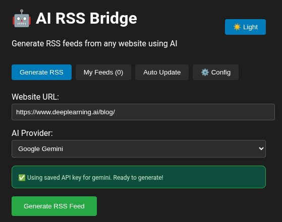
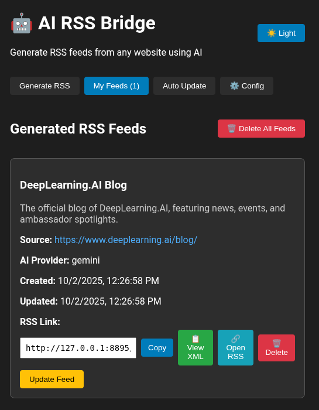

# 🤖 AI RSS Bridge

> **Transform any website into RSS feeds using Artificial Intelligence**

**Built with**: AI for syntax | Human for logic | Learning clean, scalable code  
All repos public to show my evolution as a developer 📈

---

## ⚠️ Status: IN ACTIVE DEVELOPMENT  

**What works**: LinkedIn, Medium (with login), WordPress, most news sites  
**What doesn't**: Some sites with aggressive anti-bot, image extraction (temp disabled)

---

A powerful RSS feed generator that uses AI to extract structured content from any website. Features smart pattern learning, automatic updates, and multi-AI provider support.



## ✨ Key Features

### 🧠 **Intelligent Content Extraction**
- **Multi-AI Support**: OpenAI GPT, Google Gemini, Claude, and Perplexity AI
- **Multi-Key Fallback**: Add multiple API keys per provider with automatic fallback
- **Smart Pattern Learning**: AI analyzes websites once and saves extraction patterns
- **Zero-Token Updates**: Auto updates use saved patterns without consuming API credits
- **Fallback Recovery**: Automatically uses AI if website structure changes

### 🚀 **Advanced Automation**
- **Smart Scraper**: Updates feeds using learned patterns (no AI needed)
- **Auto-Update Scheduler**: Hourly automatic updates for all feeds
- **Manual Re-analysis**: Force AI re-analysis when sites change structure
- **Pattern Persistence**: Extraction patterns saved for efficient future updates
- **Content Caching**: 6-24 hour cache to avoid rate limiting and improve speed

### 🔐 **Login & Protected Content**
- **Login Sessions**: Save login cookies to access protected content
- **Cookie Management**: Easy-to-use interface for managing site sessions
- **Auto-Detection**: System automatically uses saved sessions for authenticated sites
- **Session Persistence**: Login sessions saved in database and reused

### 🎨 **Modern Web Interface**
- **Beautiful UI**: Clean, responsive design with dark/light themes
- **Persistent Theme**: Theme preference saved without flash on reload
- **Card-Based Display**: Visual article cards with images and descriptions
- **Feed Management**: Easy feed creation, updating, and deletion
- **Multi-Key Manager**: Add/remove multiple API keys per provider with visual interface
- **Session Manager**: Open, manage, and delete login sessions

### 🔧 **Technical Excellence**
- **Docker Ready**: Complete containerized deployment with Cloudscraper
- **RESTful API**: Comprehensive API for all operations
- **Image Extraction**: Intelligent image detection and URL resolution
- **Anti-Bot Bypass**: 9 different fetch strategies including Cloudscraper
- **Error Recovery**: Robust error handling and logging
- **Duplicate Prevention**: Prevents adding the same API key to multiple providers

## 📸 Screenshots

### Main Interface

*Clean interface for generating RSS feeds from any website*

### Feed Management

*Visual feed management with article previews and controls*

## 🚀 Quick Start

### Prerequisites
- Docker and Docker Compose
- AI Provider API Key (OpenAI, Gemini, Claude, or Perplexity)

### Installation

1. **Clone the repository**
```bash
git clone <your-repository-url>
cd ai-rss-bridge
```

2. **Start the application**
```bash
docker compose up --build -d
```

3. **Access the application**
   - Open your browser to: http://127.0.0.1:8895
   - The application will be ready to use!

### First Use

1. **Configure API Keys**
   - Go to the "⚙️ Config" tab
   - Add your AI provider API key (encrypted storage)
   - **NEW**: Add multiple keys per provider for automatic fallback
   - Click "Manage" to view, add, or remove keys
   - Keys are saved securely for future use

2. **Optional: Add Login Sessions** (for protected content)
   - Go to "🔐 Login Sessions" tab
   - Enter website URL (e.g., LinkedIn, Medium)
   - Click "Open Website to Login" - log in on their site
   - Come back and click "Save Session"
   - Or use "Advanced" to paste cookies manually from DevTools

3. **Generate Your First RSS Feed**
   - Go to "Generate RSS" tab
   - Enter any website URL
   - Select your AI provider
   - Click "Generate RSS Feed"
   - System automatically uses saved login if available

4. **Copy RSS Link**
   - Use the generated RSS URL in your favorite RSS reader
   - Links work with Feedly, Inoreader, or any RSS client
   - Updates automatically every hour (configurable)

## 💡 Pro Tips

If a site doesn't work immediately, try:
1. **Add a login session first** - Many sites work better when authenticated
2. **Use a different AI provider** - Gemini vs OpenAI may yield different results
3. **Retry after a few minutes** - API rate limits are temporary
4. **Try individual article URLs** instead of homepage

---

## 🔥 What's New in v2.0

### 🔑 Multi-Key Fallback System
Never worry about rate limits again! Add multiple API keys per provider:
- **Add unlimited keys**: Each provider can have multiple API keys
- **Automatic failover**: If one key fails, system tries the next
- **Visual management**: See all your keys (masked) and manage them easily
- **Smart rotation**: Distributes load across keys

**Example Use Case**: Add 3 Gemini keys → System automatically rotates between them → 3x the rate limit!

### 🔐 Login Sessions for Protected Content
Access LinkedIn, Medium, Substack, and other sites requiring login:
- **Simple workflow**: Click "Login" → Log in on site → Save session
- **Cookie capture**: Automatic or manual cookie import from DevTools
- **Persistent sessions**: Saved in database, reused automatically
- **Visual indicator**: See which sites you're logged into

**Example Use Case**: Save LinkedIn session → Generate feed from your home feed → Get personalized content updates!

### 💾 Smart Content Caching
Reduce API costs and avoid rate limiting:
- **6-24 hour cache**: Content cached based on URL
- **Automatic invalidation**: Cache expires automatically
- **Faster generation**: Cached content loads instantly
- **Cost savings**: Significantly reduces AI API calls

**Example**: First generation uses AI → Next 24 hours use cache → Zero additional API cost!

### 🛡️ Advanced Anti-Bot Protection
Access even the most protected websites:
- **9 fetch strategies**: Multiple approaches to bypass protection
- **Cloudscraper integration**: Handles Cloudflare and similar protections
- **Browser rotation**: Tries Chrome, Firefox, Safari user agents
- **Smart delays**: Adds delays to avoid detection
- **Auto RSS detection**: Finds native RSS feeds automatically

**Example**: DeepLearning.AI blocks normal scrapers → Our system tries 9 different methods → Success!

## 🧠 How the Smart System Works

### Initial Analysis (Uses AI)
```
Website URL → AI Analysis → Extract Articles + Save Patterns → RSS Feed
                ↓
           Store extraction patterns for future use
```

### Smart Updates (Zero AI Cost)
```
Scheduled Update → Use Saved Patterns → Smart Scraping → Updated RSS
                     ↓
               No API calls needed!
```

### Auto-Recovery
```
Smart Scraping Fails → Fallback to AI → Update Patterns → Continue
```

This revolutionary approach means:
- **🎯 AI analyzes once**: Learns website structure and saves "extraction recipes"
- **⚡ Updates without AI**: Uses saved patterns for lightning-fast, cost-free updates
- **🔄 Self-healing**: Automatically detects changes and re-learns when needed
- **💰 Cost efficient**: Minimal API usage after initial setup

## 🔌 API Reference

### Core Endpoints

**Feed Management:**
```http
GET  /api/info                    # API information
POST /api/generate                # Generate new RSS feed (uses cache if available)
GET  /api/feeds                   # List all feeds
GET  /api/rss/{feed_id}          # Access RSS XML
POST /api/update/{feed_id}       # Smart update (no AI)
POST /api/reanalyze/{feed_id}    # Re-analyze with AI
DELETE /api/feeds/{feed_id}      # Delete specific feed
DELETE /api/feeds/all            # Delete all feeds
```

**Configuration (Multi-Key Support):**
```http
GET    /api/config/saved-providers         # List providers with key counts
GET    /api/config/api-keys/{provider}/all # Get all keys for provider (masked)
POST   /api/config/api-keys                # Save API key (encrypted, prevents duplicates)
DELETE /api/config/api-keys/{provider}     # Remove specific API key
```

**Login Sessions (NEW):**
```http
GET    /api/sessions               # List all saved login sessions
POST   /api/sessions               # Save new login session with cookies
DELETE /api/sessions/{site_url}    # Delete login session
```

**Scheduler:**
```http
GET  /api/scheduler/status        # Get auto-update status
POST /api/scheduler/start         # Start auto-updates
POST /api/scheduler/stop          # Stop auto-updates
```

**Content Cache (NEW):**
```http
# Automatic - no manual endpoints
# Content cached for 6-24 hours based on URL
# Reduces API calls and avoids rate limiting
```

### Example Usage

**Generate RSS Feed:**
```bash
curl -X POST http://127.0.0.1:8895/api/generate \\
  -H "Content-Type: application/json" \\
  -d '{
    "url": "https://example.com/blog",
    "ai_provider": "openai",
    "api_key": "your-api-key"
  }'
```

**Access RSS XML:**
```bash
curl http://127.0.0.1:8895/api/rss/1
```
## 🏗️ Architecture

### Backend (Flask + Python)
- **AI Providers**: Modular AI integration system
- **Smart Scraper**: Pattern-based content extraction
- **Database**: SQLite with encrypted API key storage
- **Scheduler**: Background auto-update system
- **RSS Generator**: Clean XML feed generation

### Frontend (React)
- **Modern UI**: Responsive design with Bootstrap
- **State Management**: Local storage for preferences
- **Theme Support**: Dark/light mode switching
- **Real-time Updates**: Live feed status monitoring

### Data Flow
```
User Input → AI Analysis → Pattern Storage → RSS Generation
     ↓              ↓              ↓             ↓
Web Interface → Backend API → SQLite DB → RSS XML
     ↓              ↓              ↓             ↓
Feed Reader ← Auto Updates ← Smart Scraper ← Saved Patterns
```

## ⚠️ Current Status & Limitations

### ✅ Fully Working Features
- ✅ RSS feed generation from any website
- ✅ Multi-AI provider support (OpenAI, Gemini, Claude, Perplexity)
- ✅ **Multi-key fallback system** - Add multiple API keys per provider
- ✅ **Login session management** - Access protected content with saved cookies
- ✅ **Content caching** - 6-24h cache to avoid rate limiting
- ✅ **Anti-bot bypass** - 9 different fetch strategies including Cloudscraper
- ✅ Smart pattern learning and storage
- ✅ Manual feed updates and re-analysis
- ✅ Secure API key management with duplicate prevention
- ✅ Image extraction and URL resolution
- ✅ **Persistent dark/light theme** - No flash on reload
- ✅ Docker deployment with Cloudscraper support
- ✅ **Bulk feed deletion** - Delete all feeds at once
- ✅ Auto-update scheduler with hourly updates

### 🎯 Recently Added (v2.0)
- ✨ **Multi-Key System**: Add unlimited API keys per provider with automatic fallback
- 🔐 **Login Sessions**: Save cookies to access LinkedIn, Medium, and other protected sites
- 💾 **Content Cache**: Smart caching reduces API costs and improves speed
- �️ **Advanced Anti-Bot**: Cloudscraper + 9 strategies to bypass protection
- 🎨 **Better UX**: Persistent theme, open session URLs, advanced cookie input
- 🔒 **Security**: Prevents duplicate API keys across providers

✨ **Vision**: Transform any link into RSS XML for feed reader apps

## 🛠️ Development

### Project Structure
```
ai-rss-bridge/
├── backend/                    # Flask API server
│   ├── ai_providers.py        # AI integration modules (multi-key support)
│   ├── smart_scraper.py       # Pattern-based scraping
│   ├── database.py            # SQLite (feeds, cache, sessions)
│   ├── config_manager.py      # Encrypted multi-key management
│   ├── rss_generator.py       # RSS XML generation
│   ├── scheduler.py           # Auto-update system
│   └── requirements.txt       # Includes cloudscraper
├── frontend/                   # React web interface
│   ├── src/
│   │   ├── App.js            # Main app with all tabs
│   │   ├── ApiKeyInput.js    # Key configuration
│   │   └── ManageApiKeys.js  # Multi-key manager (NEW)
│   └── public/               # Static assets
├── data/                      # Persistent data storage
│   ├── feeds.db              # Main database
│   ├── config.json           # Encrypted API keys
│   └── encryption.key        # Encryption key
└── docker-compose.yml        # Container orchestration
```

### Local Development

**Backend:**
```bash
cd backend
pip install -r requirements.txt
python app.py
```

**Frontend:**
```bash
cd frontend
npm install
npm start
```

### Environment Variables
```bash
# Optional: Set custom ports
BACKEND_PORT=5000
FRONTEND_PORT=8895
FLASK_ENV=development
```

## � Pro Tips & Best Practices

### Multi-Key Strategy
- Add 2-3 keys per provider for redundancy
- Use different providers for different sites (Gemini for blogs, GPT for complex sites)
- Monitor which keys are being used in logs

### Login Sessions
- Save sessions for sites you visit frequently
- Re-save sessions if you see "Logged Out" status
- Use browser DevTools (F12 → Application → Cookies) for manual cookie export

### Dealing with 403 Errors
1. Check if site has official RSS feed
2. Add login session if site requires authentication
3. Try individual article URLs instead of homepage
4. Use "Update Feed" button to retry with cache

### Optimizing Costs
- Let cache work for 24h before regenerating
- Use "Update Feed" (smart scraper) instead of "Re-analyze" when possible
- Add multiple keys to distribute load and avoid rate limits

### Best Sites to Convert
- ✅ **Blogs & News**: Medium, Substack, WordPress sites
- ✅ **Tech Sites**: GitHub, Stack Overflow, Dev.to
- ✅ **Social**: LinkedIn newsletters, Twitter threads (with session)
- ✅ **Documentation**: API docs, changelogs, release notes
- ⚠️ **Heavy JS sites**: May need multiple attempts
- ❌ **Video platforms**: YouTube, TikTok (use official RSS if available)

## �🔒 Security

- **Encrypted Storage**: All API keys stored with Fernet encryption
- **Cookie Security**: Login cookies encrypted and stored locally
- **No Data Leaks**: No API keys or personal data in logs
- **Local Processing**: All data processed locally, no external data sharing
- **Secure Defaults**: CORS protection and input validation
- **Duplicate Prevention**: System prevents adding same key to multiple providers

**AI Providers (choose one or more):**
- OpenAI API key (GPT models)
- Google Gemini API key
- Anthropic Claude API key
- Perplexity AI API key


## 📄 License

This project is licensed under the MIT License - see the [LICENSE](LICENSE) file for details.

---

**Transform any website into a beautiful RSS feed with the power of AI! 🚀**
