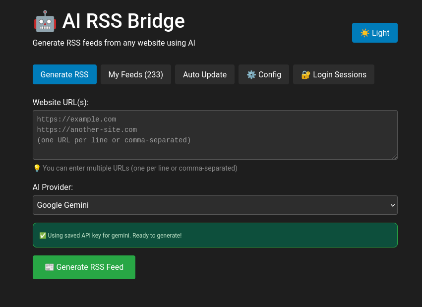

# 🤖 AI RSS Bridge

> **Transform any website into RSS feeds using Artificial Intelligence**

A powerful, intelligent RSS feed generator that uses AI to extract structured content from any website and create clean, readable RSS feeds. Features smart pattern learning, automatic updates, and multi-AI provider support.



## ✨ Key Features

### 🧠 **Intelligent Content Extraction**
- **Multi-AI Support**: OpenAI GPT, Google Gemini, Claude, and Perplexity AI
- **Smart Pattern Learning**: AI analyzes websites once and saves extraction patterns
- **Zero-Token Updates**: Auto updates use saved patterns without consuming API credits
- **Fallback Recovery**: Automatically uses AI if website structure changes

### 🚀 **Advanced Automation**
- **Smart Scraper**: Updates feeds using learned patterns (no AI needed)
- **Auto-Update Scheduler**: Hourly automatic updates for all feeds
- **Manual Re-analysis**: Force AI re-analysis when sites change structure
- **Pattern Persistence**: Extraction patterns saved for efficient future updates

### 🎨 **Modern Web Interface**
- **Beautiful UI**: Clean, responsive design with dark/light themes
- **Card-Based Display**: Visual article cards with images and descriptions
- **Feed Management**: Easy feed creation, updating, and deletion
- **API Key Manager**: Secure encrypted storage of AI provider keys

### 🔧 **Technical Excellence**
- **Docker Ready**: Complete containerized deployment
- **RESTful API**: Comprehensive API for all operations
- **Image Extraction**: Intelligent image detection and URL resolution
- **Error Recovery**: Robust error handling and logging

## 📸 Screenshots

### Main Interface

*Clean interface for generating RSS feeds from any website*

### Feed Management

*Visual feed management with article previews and controls*

## 🚀 Quick Start

### Prerequisites
- Docker and Docker Compose
- AI Provider API Key (OpenAI, Gemini, Claude, or Perplexity)

### Installation

1. **Clone the repository**
```bash
git clone <your-repository-url>
cd ai-rss-bridge
```

2. **Start the application**
```bash
docker compose up --build -d
```

3. **Access the application**
   - Open your browser to: http://127.0.0.1:8895
   - The application will be ready to use!

### First Use

1. **Configure API Keys**
   - Go to the "⚙️ Config" tab
   - Add your AI provider API key (encrypted storage)
   - Keys are saved securely for future use

2. **Generate Your First RSS Feed**
   - Go to "Generate RSS" tab
   - Enter any website URL
   - Select your AI provider
   - Click "Generate RSS Feed"

3. **Copy RSS Link**
   - Use the generated RSS URL in your favorite RSS reader
   - Links work with Feedly, Inoreader, or any RSS client

## 🧠 How the Smart System Works

### Initial Analysis (Uses AI)
```
Website URL → AI Analysis → Extract Articles + Save Patterns → RSS Feed
                ↓
           Store extraction patterns for future use
```

### Smart Updates (Zero AI Cost)
```
Scheduled Update → Use Saved Patterns → Smart Scraping → Updated RSS
                     ↓
               No API calls needed!
```

### Auto-Recovery
```
Smart Scraping Fails → Fallback to AI → Update Patterns → Continue
```

This revolutionary approach means:
- **🎯 AI analyzes once**: Learns website structure and saves "extraction recipes"
- **⚡ Updates without AI**: Uses saved patterns for lightning-fast, cost-free updates
- **🔄 Self-healing**: Automatically detects changes and re-learns when needed
- **💰 Cost efficient**: Minimal API usage after initial setup

## 🔌 API Reference

### Core Endpoints

**Feed Management:**
```http
GET  /api/info                    # API information
POST /api/generate                # Generate new RSS feed
GET  /api/feeds                   # List all feeds
GET  /api/rss/{feed_id}          # Access RSS XML
POST /api/update/{feed_id}       # Smart update (no AI)
POST /api/reanalyze/{feed_id}    # Re-analyze with AI
```

**Configuration:**
```http
GET    /api/config/api-keys       # List saved providers
POST   /api/config/api-keys       # Save API key (encrypted)
DELETE /api/config/api-keys/{provider}  # Remove API key
```

**Scheduler:**
```http
GET  /api/scheduler/status        # Get auto-update status
POST /api/scheduler/start         # Start auto-updates
POST /api/scheduler/stop          # Stop auto-updates
```

### Example Usage

**Generate RSS Feed:**
```bash
curl -X POST http://127.0.0.1:8895/api/generate \\
  -H "Content-Type: application/json" \\
  -d '{
    "url": "https://example.com/blog",
    "ai_provider": "openai",
    "api_key": "your-api-key"
  }'
```

**Access RSS XML:**
```bash
curl http://127.0.0.1:8895/api/rss/1
```
## 🏗️ Architecture

### Backend (Flask + Python)
- **AI Providers**: Modular AI integration system
- **Smart Scraper**: Pattern-based content extraction
- **Database**: SQLite with encrypted API key storage
- **Scheduler**: Background auto-update system
- **RSS Generator**: Clean XML feed generation

### Frontend (React)
- **Modern UI**: Responsive design with Bootstrap
- **State Management**: Local storage for preferences
- **Theme Support**: Dark/light mode switching
- **Real-time Updates**: Live feed status monitoring

### Data Flow
```
User Input → AI Analysis → Pattern Storage → RSS Generation
     ↓              ↓              ↓             ↓
Web Interface → Backend API → SQLite DB → RSS XML
     ↓              ↓              ↓             ↓
Feed Reader ← Auto Updates ← Smart Scraper ← Saved Patterns
```

## ⚠️ Current Status & Limitations

### ✅ Fully Working Features
- ✅ RSS feed generation from any website
- ✅ Multi-AI provider support (OpenAI, Gemini, Claude, Perplexity)
- ✅ Smart pattern learning and storage
- ✅ Manual feed updates and re-analysis
- ✅ Secure API key management
- ✅ Image extraction and URL resolution
- ✅ Dark/light theme support
- ✅ Docker deployment

### 🧪 Beta Features (Testing Required)
- ⚠️ **Auto-Update Scheduler**: Needs extensive testing with various website types
- ⚠️ **Image Extraction**: Works well but not all websites have optimal image support
- ⚠️ **Pattern Recognition**: May need manual re-analysis for complex site changes

### 🔮 Future Enhancements
- 🔐 **Authentication system for protected content access**
- � **Universal content aggregation (LinkedIn, forums, groups)**
- �🌍 **Multi-language Support**: Generate feeds in different languages using AI translation
- 📊 **Analytics Dashboard**: Feed performance and update statistics
- 🔄 **Webhook Support**: Real-time notifications for feed updates
- 🎯 **Custom Patterns**: User-defined extraction rules
- 📱 **Mobile App**: Native mobile application

For now you can use [IMAP2RSS integration for email newsletters](https://github.com/abner-dos-reis/Imap2RSS)

✨ **Vision**: Transform any link into RSS XML for feed reader apps

## 🛠️ Development

### Project Structure
```
ai-rss-bridge/
├── backend/               # Flask API server
│   ├── ai_providers.py   # AI integration modules
│   ├── smart_scraper.py  # Pattern-based scraping
│   ├── database.py       # SQLite database manager
│   ├── rss_generator.py  # RSS XML generation
│   └── scheduler.py      # Auto-update system
├── frontend/             # React web interface
│   ├── src/App.js       # Main application component
│   └── public/          # Static assets
├── data/                # Persistent data storage
└── docker-compose.yml   # Container orchestration
```

### Local Development

**Backend:**
```bash
cd backend
pip install -r requirements.txt
python app.py
```

**Frontend:**
```bash
cd frontend
npm install
npm start
```

### Environment Variables
```bash
# Optional: Set custom ports
BACKEND_PORT=5000
FRONTEND_PORT=8895
FLASK_ENV=development
```

## 🔒 Security

- **Encrypted Storage**: All API keys stored with Fernet encryption
- **No Data Leaks**: No API keys or personal data in logs
- **Local Processing**: All data processed locally, no external data sharing
- **Secure Defaults**: CORS protection and input validation

## 📋 Requirements

**System:**
- Docker 20.0+
- Docker Compose 2.0+
- 2GB RAM minimum
- 1GB disk space

**AI Providers (choose one or more):**
- OpenAI API key (GPT models)
- Google Gemini API key
- Anthropic Claude API key
- Perplexity AI API key

## 🤝 Contributing

1. Fork the repository
2. Create a feature branch (`git checkout -b feature/amazing-feature`)
3. Commit your changes (`git commit -m 'Add amazing feature'`)
4. Push to the branch (`git push origin feature/amazing-feature`)
5. Open a Pull Request

## 📄 License

This project is licensed under the MIT License - see the LICENSE file for details.

## 🙋‍♂️ Support

- **Documentation**: Check this README and code comments
- **Issues**: Use GitHub Issues for bug reports
- **Discussions**: Use GitHub Discussions for questions

## 🌟 Acknowledgments

- **AI Providers**: OpenAI, Google, Anthropic, Perplexity for excellent APIs
- **Open Source**: Built with Flask, React, Bootstrap, and SQLite
- **Community**: Thanks to all contributors and users

---

**Transform any website into a beautiful RSS feed with the power of AI! 🚀**